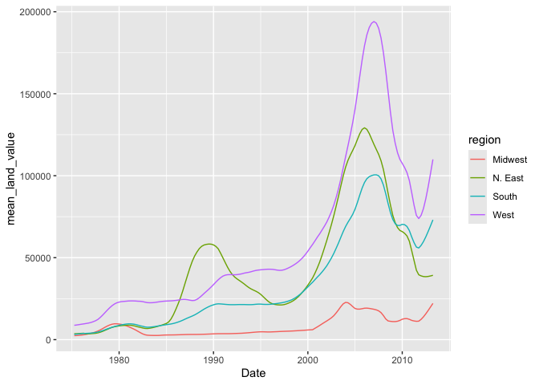
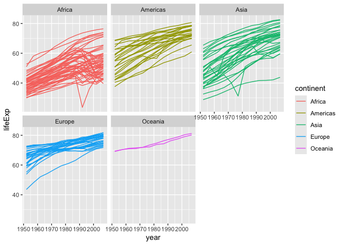

# Assignment_5


# Assignment 5: Data transformation and visualization - Part 2

First, load all the required packages with the following code. Install
them if they are not installed yet.

``` r
library(tidyverse)
library(knitr)
library(gapminder)
```

## Exercise 1. Trends in land value

This excercise uses a dataset that describes the trends in land value
(`Land.Value`), among other variables, in different states in the US
1975-2013. The states are grouped into four different regions, under the
variable `region`. This dataset was obtained from the Data Science
Services of Harvard University.

``` r
housing <- read_csv("https://raw.githubusercontent.com/nt246/NTRES-6100-data-science/master/datasets/landdata_states.csv")
housing |> 
  head() |> 
  kable() 
```

| State | region | Date | Home.Value | Structure.Cost | Land.Value | Land.Share..Pct. | Home.Price.Index | Land.Price.Index | Year | Qrtr |
|:---|:---|---:|---:|---:|---:|---:|---:|---:|---:|---:|
| AK | West | 2010.25 | 224952 | 160599 | 64352 | 28.6 | 1.481 | 1.552 | 2010 | 1 |
| AK | West | 2010.50 | 225511 | 160252 | 65259 | 28.9 | 1.484 | 1.576 | 2010 | 2 |
| AK | West | 2009.75 | 225820 | 163791 | 62029 | 27.5 | 1.486 | 1.494 | 2009 | 3 |
| AK | West | 2010.00 | 224994 | 161787 | 63207 | 28.1 | 1.481 | 1.524 | 2009 | 4 |
| AK | West | 2008.00 | 234590 | 155400 | 79190 | 33.8 | 1.544 | 1.885 | 2007 | 4 |
| AK | West | 2008.25 | 233714 | 157458 | 76256 | 32.6 | 1.538 | 1.817 | 2008 | 1 |

#### 1.1 Washington DC was not assigned to a region in this dataset. According to the United States Census Bureau, however, DC is part of the South region. Here:

- Change the region of DC to “South” (Hint: there are multiple ways to
  do this, but `mutate()` and `ifelse()` might be helpful)

``` r
housing |> 
  mutate(region = ifelse(is.na(region), "South", region))
```

    # A tibble: 7,803 × 11
       State region  Date Home.Value Structure.Cost Land.Value Land.Share..Pct.
       <chr> <chr>  <dbl>      <dbl>          <dbl>      <dbl>            <dbl>
     1 AK    West   2010.     224952         160599      64352             28.6
     2 AK    West   2010.     225511         160252      65259             28.9
     3 AK    West   2010.     225820         163791      62029             27.5
     4 AK    West   2010      224994         161787      63207             28.1
     5 AK    West   2008      234590         155400      79190             33.8
     6 AK    West   2008.     233714         157458      76256             32.6
     7 AK    West   2008.     232999         160092      72906             31.3
     8 AK    West   2009.     232164         162704      69460             29.9
     9 AK    West   2009      231039         164739      66299             28.7
    10 AK    West   2009.     229395         165424      63971             27.9
    # ℹ 7,793 more rows
    # ℹ 4 more variables: Home.Price.Index <dbl>, Land.Price.Index <dbl>,
    #   Year <dbl>, Qrtr <dbl>

- Create a new tibble or regular dataframe consisting of this new
  updated `region` variable along with the original variables `State`,
  `Date` and `Land.Value` (and no others)

``` r
housing |> 
  mutate(region = ifelse(is.na(region), "South", region)) |> 
  select(region, State, Date, Land.Value)
```

    # A tibble: 7,803 × 4
       region State  Date Land.Value
       <chr>  <chr> <dbl>      <dbl>
     1 West   AK    2010.      64352
     2 West   AK    2010.      65259
     3 West   AK    2010.      62029
     4 West   AK    2010       63207
     5 West   AK    2008       79190
     6 West   AK    2008.      76256
     7 West   AK    2008.      72906
     8 West   AK    2009.      69460
     9 West   AK    2009       66299
    10 West   AK    2009.      63971
    # ℹ 7,793 more rows

- Pull out the records from DC in this new data frame. How many records
  are there from DC? Show the first 6 lines.

``` r
housing |> 
  mutate(region = ifelse(is.na(region), "South", region)) |> 
  select(region, State, Date, Land.Value) |> 
  filter(State == "DC") |> 
  head(6) |> 
  kable()
```

| region | State |    Date | Land.Value |
|:-------|:------|--------:|-----------:|
| South  | DC    | 2003.00 |     290522 |
| South  | DC    | 2003.25 |     305673 |
| South  | DC    | 2003.50 |     323078 |
| South  | DC    | 2003.75 |     342010 |
| South  | DC    | 2004.00 |     361999 |
| South  | DC    | 2004.25 |     382792 |

Answer: 153

#### 1.2 Generate a tibble/dataframe that summarizes the mean land value of each region at each time point and show its first 6 lines.

``` r
housing |>
  mutate(region = ifelse(is.na(region), "South", region)) |> 
  group_by(Date, region) |> 
  summarize(mean_land_value = mean(Land.Value)) |> 
  select(region, Date, mean_land_value) |> 
  arrange(region, Date) |> 
  head(6) |> 
  kable()
```

| region  |    Date | mean_land_value |
|:--------|--------:|----------------:|
| Midwest | 1975.25 |        2452.167 |
| Midwest | 1975.50 |        2498.917 |
| Midwest | 1975.75 |        2608.167 |
| Midwest | 1976.00 |        2780.000 |
| Midwest | 1976.25 |        2967.333 |
| Midwest | 1976.50 |        3212.833 |

#### 1.3 Using the tibble/dataframe from 1.2, plot the trend in mean land value of each region through time.

``` r
housing |>
  mutate(region = ifelse(is.na(region), "South", region)) |> 
  group_by(Date, region) |> 
  summarize(mean_land_value = mean(Land.Value)) |> 
  ggplot() + 
  geom_line(aes(x = Date, y = mean_land_value, color = region))
```



## Exercise 2. Life expectancy and GDP per capita 1952-2007

This exercise uses the `gapminder` dataset from the `gapminder` package.
It describes the life expectancy (`lifeExp`), GDP per capita
(`gdpPercap`), and population (`pop`) of 142 countries from 1952 to
2007. These countries can be grouped into 5 continents. As a reminder,
**reproduce the following plots exactly as shown**.

``` r
gapminder |> 
  head() |> 
  kable()
```

| country     | continent | year | lifeExp |      pop | gdpPercap |
|:------------|:----------|-----:|--------:|---------:|----------:|
| Afghanistan | Asia      | 1952 |  28.801 |  8425333 |  779.4453 |
| Afghanistan | Asia      | 1957 |  30.332 |  9240934 |  820.8530 |
| Afghanistan | Asia      | 1962 |  31.997 | 10267083 |  853.1007 |
| Afghanistan | Asia      | 1967 |  34.020 | 11537966 |  836.1971 |
| Afghanistan | Asia      | 1972 |  36.088 | 13079460 |  739.9811 |
| Afghanistan | Asia      | 1977 |  38.438 | 14880372 |  786.1134 |

#### 2.1 Use a scatterplot to explore the relationship between per capita GDP (`gdpPercap`) and life expectancy (`lifeExp`) in the year 2007.

``` r
gapminder |> 
  filter(year == "2007") |> 
  ggplot() +
  geom_point(aes(x = gdpPercap, y = lifeExp))
```


#### 2.2 Add a smoothing line to the previous plot.

``` r
gapminder |> 
  filter(year == "2007") |> 
  ggplot(aes(x = gdpPercap, y = lifeExp)) +
  geom_point() +
  geom_smooth()
```


#### 2.3 Exclude Oceania from the previous plot, show each continent in a different color, and fit a separate smoothing line to each continent to identify differences in this relationship between continents. Turn off the confidence intervals.

Note: only two Oceanian countries are included in this dataset, and
`geom_smooth()` does not work with two data points, which is why they
are excluded.

``` r
gapminder |> 
  filter(year == "2007", continent != "Oceania") |> 
  ggplot(aes(x = gdpPercap, y = lifeExp, color = continent)) +
  geom_point() +
  geom_smooth(se = FALSE)
```


#### 2.4 Use faceting to solve the same problem. Include the confidence intervals in this plot.

``` r
gapminder |> 
  filter(year == "2007", continent != "Oceania") |> 
  ggplot(aes(x = gdpPercap, y = lifeExp, color = continent)) +
  geom_point() +
  geom_smooth() + 
  facet_wrap(~continent)
```


#### 2.5 Explore the trend in life expectancy through time in each continent. Color by continent.

``` r
gapminder |> 
  ggplot(aes(x = year, y = lifeExp, color = continent)) +
  geom_line(aes(group = country)) +
  facet_wrap(~continent)
```



#### 2.6 From the previous plot, we see some abnormal trends in Asia and Africa, where the the life expectancy in some countries sharply dropped at certain time periods. Here, we look into what happened in Asia in more detail. First, create a new dataset by filtering only the Asian countries. Show the first 6 lines of this filtered dataset.

``` r
gapminder_asia <- gapminder |> 
  filter(continent == "Asia")

gapminder_asia |> 
  head(6) |> 
  kable()
```

| country     | continent | year | lifeExp |      pop | gdpPercap |
|:------------|:----------|-----:|--------:|---------:|----------:|
| Afghanistan | Asia      | 1952 |  28.801 |  8425333 |  779.4453 |
| Afghanistan | Asia      | 1957 |  30.332 |  9240934 |  820.8530 |
| Afghanistan | Asia      | 1962 |  31.997 | 10267083 |  853.1007 |
| Afghanistan | Asia      | 1967 |  34.020 | 11537966 |  836.1971 |
| Afghanistan | Asia      | 1972 |  36.088 | 13079460 |  739.9811 |
| Afghanistan | Asia      | 1977 |  38.438 | 14880372 |  786.1134 |

#### 2.7 Using the filtered dataset, identify the countries that had abnormal trends in life expectancy **by plotting**, and discuss historical events possibly explaining these trends. (Hint: facet by country)

``` r
gapminder_asia |> 
  ggplot(aes(x = year, y = lifeExp)) + 
  geom_line() + 
  facet_wrap(~country)
```


Answer: China has a steep drop around 1960, possibly because of the mass
famine. Cambodia also has a steep drop around 1975 to 1978, probably
because of the mass genocide that happened in 1975, and the
Cambodian-Vietnamese war that happened in 1978.

------------------------------------------------------------------------
